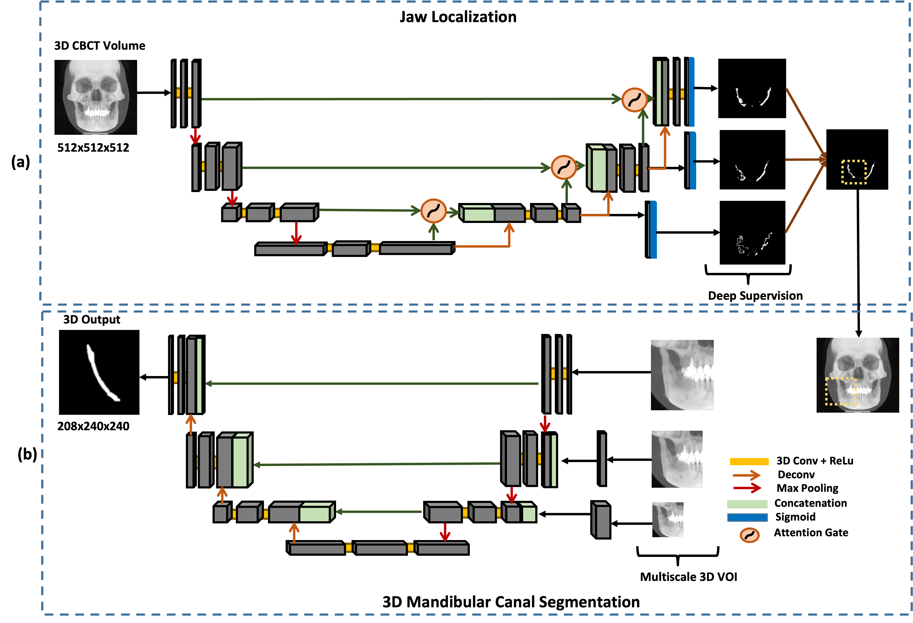

# [Dual-Stage Deeply Supervised Attention-based Convolutional Neural Networks for Mandibular Canal Segmentation in CBCT Scans](https://www.mdpi.com/1424-8220/22/24/9877)

Accurate segmentation of mandibular canals in lower jaws is important in dental implantology. Medical experts determine the implant position and dimensions manually from 3D CT images to avoid damaging the mandibular nerve inside the canal. In this paper, we propose a novel dual-stage deep learning-based scheme for the automatic segmentation of the mandibular canal. Particularly, we first enhance the CBCT scans by employing the novel histogram-based dynamic windowing scheme, which improves the visibility of mandibular canals. After enhancement, we design 3D deeply supervised attention U-Net architecture for localizing the volumes of interest (VOIs), which contain the mandibular canals (i.e., left and right canals). Finally, we employed the multi-scale input residual U-Net architecture (MS-R-UNet) to segment the mandibular canals using VOIs accurately. The proposed method has been rigorously evaluated on 500 scans. The results demonstrate that our technique outperforms the current state-of-the-art segmentation performance and robustness methods.

[Previous version](https://arxiv.org/abs/2210.03739) 

# Dataset
In this work, we utilized two datasets, one dataset which we developed in this study 179
and the other publicly available dataset released by [Cipriano et al](https://ieeexplore.ieee.org/document/9686728).
For more details, please refer to research paper updated version mentioned above.
